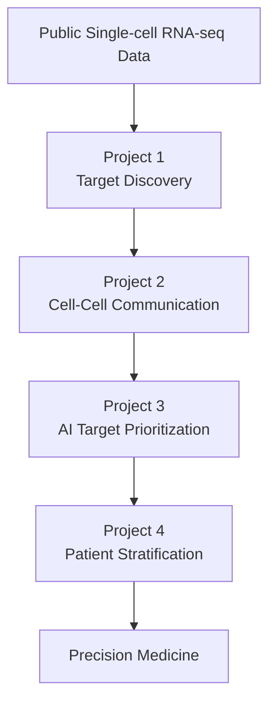

# AI Computational Immunology Portfolio

## Overview

This repository serves as the central portfolio for my computational biology and AI projects focused on autoimmune disease, single-cell transcriptomics, therapeutic target discovery, and precision medicine.

The projects are organized as a progressive research pipeline that mirrors a translational drug discovery workflow.

---

## Research Workflow

---

## Portfolio Projects

The projects below are designed as a continuous computational biology workflow.
Each repository builds upon the previous one, progressing from biological discovery to AI-assisted precision medicine.

<table>

<tr>

<td align="center" width="50%">

<h3>Project 1</h3>

<b>Cross-Species Therapeutic Target Discovery in Lupus Nephritis</b>

Identification and prioritization of therapeutic targets from human and mouse single-cell RNA-seq.

</td>

<td align="center" width="50%">

<h3>Project 2</h3>

<b>Cell–Cell Communication Analysis</b>

Inference of ligand–receptor communication networks and signaling pathways in lupus nephritis.

</td>

</tr>

<tr>

<td align="center">

<h3>Project 3</h3>

<b>AI-Driven Therapeutic Target Prioritization</b>

Integration of multiple biological evidence sources into an AI-inspired therapeutic target prioritization framework.

</td>

<td align="center">

<h3>Project 4</h3>

<b>AI-Driven Patient Stratification</b>

Patient subtype discovery using single-cell transcriptomics and machine learning.

</td>

</tr>

</table>

---

## Technical Skills Demonstrated

### Computational Biology

- Single-cell RNA-seq analysis
- Differential expression
- Cell–cell communication inference
- Patient stratification
- Therapeutic target prioritization

### Machine Learning

- Random Forest
- Feature engineering
- Unsupervised clustering
- Principal Component Analysis

### Programming

- R
- Seurat
- tidyverse
- ggplot2
- pheatmap

### Biomedical Applications

- Autoimmunity
- Lupus nephritis
- Precision medicine
- Therapeutic target discovery

---

## Long-Term Vision

The long-term goal of this portfolio is to develop an AI-driven computational platform capable of integrating:

- Single-cell transcriptomics
- Spatial transcriptomics
- Cell–cell communication
- Multi-omic datasets
- Machine learning
- Therapeutic target discovery

to accelerate precision medicine for autoimmune diseases.

---

## Citation

If you find these projects useful, please consider starring the repositories.

---

Developed as an independent computational biology and AI portfolio focused on translational immunology and precision medicine.
