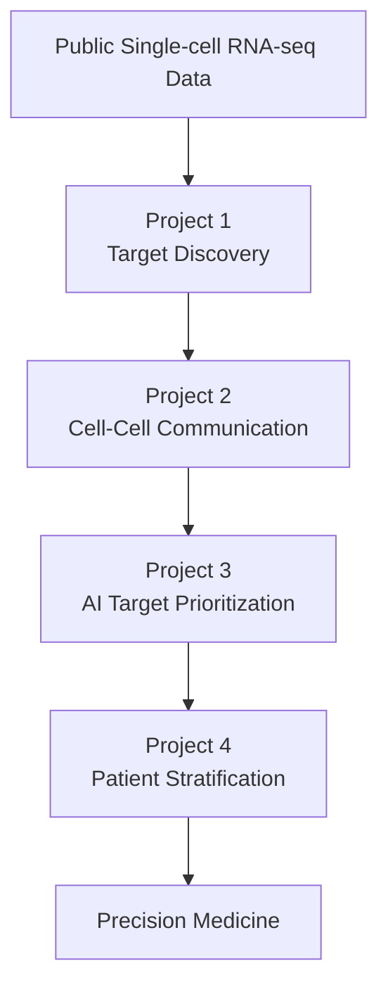

# AI Computational Immunology Portfolio

## Overview

This repository serves as the central portfolio for my computational biology and AI projects focused on autoimmune disease, single-cell transcriptomics, therapeutic target discovery, and precision medicine.

The projects are organized as a progressive research pipeline that mirrors a translational drug discovery workflow.

---

## Research Workflow

---

## Portfolio Projects

The projects below are designed as a continuous computational biology workflow.
Each repository builds upon the previous one, progressing from biological discovery to AI-assisted precision medicine.

<table>

<tr>

<td align="center" width="50%">

<h3>Project 1</h3>

<b>Lupus Nephritis Target Discovery Atlas</b>

Identification and prioritization of therapeutic targets from human and mouse single-cell RNA-seq.

</td>

<td align="center" width="50%">

<h3>Project 2</h3>

<b>Cell–Cell Communication Analysis</b>

Inference of ligand–receptor communication networks and signaling pathways in lupus nephritis.

</td>

</tr>

<tr>

<td align="center">

<h3>Project 3</h3>

<b>AI-Driven Therapeutic Target Prioritization</b>

Integration of multiple biological evidence sources into an AI-inspired therapeutic target prioritization framework.

</td>

<td align="center">

<h3>Project 4</h3>

<b>AI-Driven Patient Stratification</b>

Patient subtype discovery using single-cell transcriptomics and machine learning.

</td>

</tr>

</table>

---

## Skills Demonstrated

- Computational Biology
- Machine Learning
- Single-cell RNA sequencing
- Translational Immunology
- Precision Medicine
- R Programming
- Data Visualization
- Reproducible Research

---

## Future Projects

- Multi-omic integration
- Spatial transcriptomics
- Graph Neural Networks
- Drug repurposing AI
- Clinical response prediction
